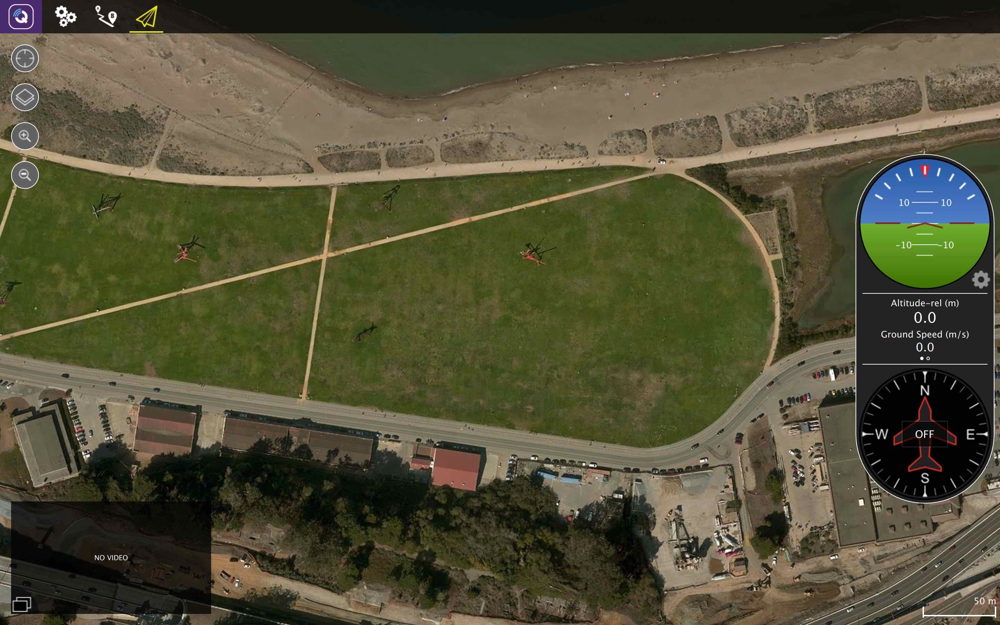

# This is QGroundControl
The first step is to [download](download_and_install.md) and install it. On its first screen you can access the main functionalities, like setup your drone, plan and monitor your flight.
 
 

 

 **Application Settings**
 Configure the QGroundControl application.

 **[Setup](SetupView/SetupView.md)**
 Configure and tune your vehicle.

 **[Plan](PlanView/PlanView.md)**
 Create autonomous missions.

 **[Fly](FlyView/FlyView.md)**
 Monitor you vehicle while flying, including streaming video.

# Connecting the drone
In most cases if you have connected to your vehicle directly via USB, through a telemetry radio or over WiFi you should not need to take any additional steps. QGroundControl should detect your vehicle and connect it automatically.

By default QGroundControl will show you the Fly view as shown here. If your vehicle requires additional setup you will be automatically shown the Setup view instead.
 
 

 

You will notice that the toolbar contains additional information when it is connected. It shows you high level status for your vehicle. By clicking on any of these items you can see more detailed information. 

 **Vehicle Messages**
 Click to show a dropdown of messages from the vehicle. This will change to a Yield sign if there are critical messages.

 **GPS Status**
 Shows you satellite count and curent hdop.

 **RC RSSI** 
 RS signal strength information.

 **Telemetry RSSI**
 Telemetry signals strength information.

 **Battery**
 Remaining battery percent.

 **Flight Mode**
 Current flight mode. Click to change flight mode.
