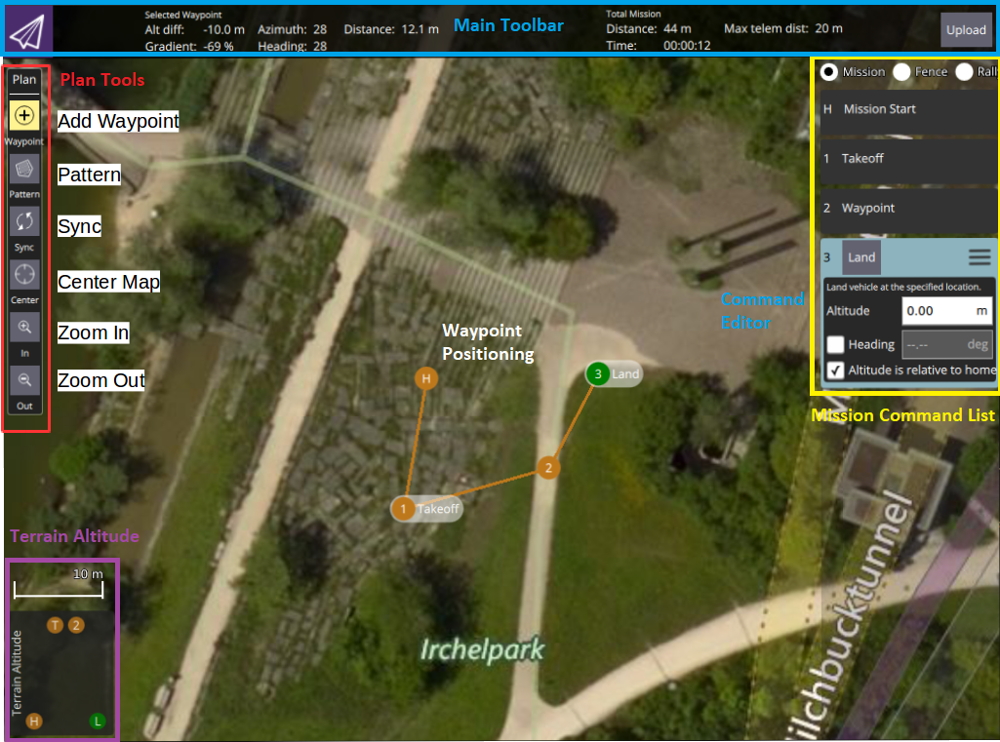

# Plan View

The *Plan View* is used to plan autonomous missions for your Vehicle. Once the mission is planned and sent to the vehicle, you switch to the [*Fly View*](../FlyView/FlyView.md) to fly the mission.

If your Vehicle supports a [GeoFence](PlanGeoFence.md) or [Rally Points](PlanRallyPoints.md) you can also set those up from the *Plan View*.

The image above shows a simple mission which starts with a takeoff at the home position (H), flies through three waypoints and then lands on the last waypoint (i.e. waypoint 3).

The steps to creating a missions are:

1. Change to *Plan View*.
2. Add waypoints or commands to the mission and edit as needed.
3. Upload the mission to the vehicle.
4. Change to *Fly View* and fly your mission.

## Plan Tools
On the left edge of the screen you will see the Plan Tools as marked in red in the image above. 

 > **Note** **Center map**, **Zoom In**, **Zoom Out** are just map visualisation tools that help user view the *Plan view* map clearly while planning missions (they don't affect the mission commands sent to the vehicle in any way).

### Add Waypoints
Click to activate the **Add Waypoint** tool. While active, clicking in the map will add new mission waypoint at the clicked location. The tool will stay active until you click it again. Once you have added a waypoint, you can select it by clicking on it and then drag it around to change its position.

### Actual vs Planned Home Position
Home position is the position the vehicle will return to and land on when in Return (to Launch/Home) mode. The home position shown in *Plan View* is merely a virtual home position a.k.a "Planned Home Position" which helps you simulate the vehicle's home position while planning a mission. Hence, you should place it where you roughly plan to start (takeoff) the vehicle from. This allows QGC to estimate mission times and to draw waypoint lines correctly to the home position. When you go out on the field and start the mission, the autopilot then replaces the mission's planned home position with the actual takeoff position as its home position. This actual home position can then be seen in the *Fly View*.

### Sync
The Sync tools allows you to move Missions back and forth to your Vehicle or a file. *Before you fly a mission you must be sure to send your Mission to your vehicle.* The tool will change to have an "!" within it to indicate that you have changes to your Mission which you have not sent to your vehicle. 

The Sync tool provides the following functionality:

* Upload (Send to Vehicle)
* Download (Load from Vehicle)
* Save to File
* Load from File
* Remove All (removes all mission waypoints from *Plan view* and from vehicle)

### Pattern

[Pattern](Pattern.md) allows you to fly a complex pattern.

## Mission Command List

On the right edge of the display is the list of mission commands for this mission. You can click on one of these to edit the values for the item. Above are a set of options to switch between editing the Mission, GeoFence and Rally Points.

### Mission Command Editors

Click on a mission command to show its editor which allows you to specify the values for the command. You can also change the type of the command by clicking on the command name, "Waypoint" in this example. This allows you to pick from the set up available commands to build your mission. To the right of the command name is a menu you can open by clicking. This menu provides you access to additional options such as Insert and Delete.

### Mission Settings
The Mission Settings panel allows you to specify values which apply to the entire mission, or settings you want to control right at the beginning of a mission. This is the first item in the mission list on the right of the screen. For example, you can change the altitude for all mission waypoints to the value you set in "Waypoint alt".

### Repeat Mission

If you want to repeat the entire mission or parts of mission, you can add a "Jump to item" command. In this command you can specify the item/waypoint number to jump to and the number of times this command should be repeated.  

## Mission Display

In the center of the map you will see a visualization of your current mission. You can click on the indicators to select them and then you can also drag them around to reposition them. 

At the top of the *Plan View* you will see the Plan Toolbar which shows information for the currently selected waypoint relative to the previous waypoint as well as statistics for the entire mission. For e.g. to the left you will find altitude difference and distance from the previous waypoint, whereas to the right you will find an estimate of the horizontal distance and time taken by the total mission. "Max telem dist" is the distance between the Planned Home position (where your GCS is expected to be) and the furthest waypoint.

At the bottom of the map you will see a representation of the height differences between your mission commands.

## Further Info

* New Plan View features for [QGC release v3.2](../releases/stable_v3.2_long.md#plan_view)
* New Plan View features for [QGC release v3.3](../releases/stable_v3.3_long.md#plan_view)

