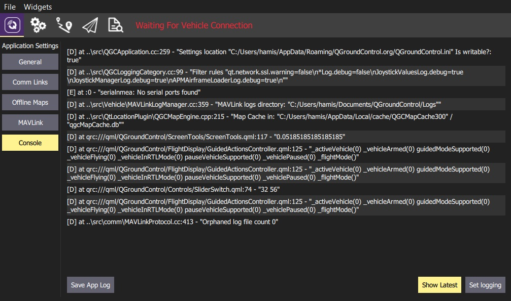

# Support

This user guide is meant to be the main provider of support for *QGroundControl*. If you find incorrect or missing information please report an [Issue](https://github.com/mavlink/qgc-user-guide/issues).

*Questions* about *QGroundControl* should be raised in the associated flight stack's discussion server at the links below:
* [PX4 Flight Stack](http://discuss.px4.io/c/qgroundcontrol/qgroundcontrol-usage) (discuss.px4.io).
* [ArduPilot Flight Stack](http://discuss.ardupilot.org/c/ground-control-software/qgroundcontrol) (discuss.ardupilot.org).


## Console Logging {#console_logging}

The *Console* can be helpful tool for diagnosing *QGroundControl* problems. It can be found in the [SettingsView > Console](../SettingsView/SettingsView.md). 



Click the **Set Logging** button to enable/disable logging information displayed by *QGroundControl*.

### Common Logging Options

The most commmonly used logging options are listed below.

Option(s) | Description
--- | ---
`LinkManagerLog`, `MultiVehicleManagerLog` | Debug connection problems.
`LinkManagerVerboseLog` | Debug very noisy connections. Continuous output of available serial ports.
`FirmwareUpgradeLog` | Debug firmware flash issues.
`ParameterLoaderLog` | Debug parameter load problems.
`ParameterLoaderVerboseLog` | Debug parameter load problems with full trace of parameters coming/going/in system.
`MissionManagerLog` | Debug mission protocol issues.
`RadioComponentControllerLog` | Debug Radio calibration issues.


### Logging from the Command Line

An alternate mechanism for logging is using the `--logging` command line option. This is handy if you are trying to get logs from a situation where *QGroundControl* crashes.

How you do this and where the traces are output vary by OS:

* Windows
  * You must open a command prompt, change directory to the **qgroundcontrol.exe** location, and run it from there:
    ```bash
    cd "\Program Files (x86)\qgroundcontrol"
    qgroundcontrol --logging:full</code>
    ```
  * When *QGroundControl* starts you should see a separate console window open which will have the log output
* OSX
  * You must run *QGroundControl* from Terminal. The Terminal app is located in Applications/Utilities. Once Terminal is open paste the following into it:
    ```bash
    cd /Applications/qgroundcontrol.app/Contents/MacOS/
    ./qgroundcontrol --logging:full
    ```
  * Log traces will output to the Terminal window.
* Linux
  * 
  ```bash
  ./qgroundcontrol-start.sh --logging:full
  ```
  * Log traces will output to the shell you are running from.


## Developer Chat {#developer_chat}

The *QGroundControl* developers as well as many *QGroundControl* users can be found on the [#QGroundControl channel on Slack](https://px4.slack.com/) or the [Gitter](https://gitter.im/mavlink/qgroundcontrol) channel. If you are a heavy user of *QGroundControl* and want to keep up to date on the latest information or help with *QGroundControl* we suggest monitoring that channel.


## GitHub Issues

Issues are used to track bugs against *QGroundControl* as well as feature requests for later versions. The current list of issues can be found on [GitHub here](https://github.com/mavlink/qgroundcontrol/issues).

> **Note** Please contact our developers using the [IM](#developer_chat) channels **before** creating GitHub issues! 


### Feature Requests

Feature Requests should first be discussed on a [developer IM](#developer_chat) channel. The developer team will direct you to create a feature request on Github if necessary (or refer you to the appropriate existing feature).

### Reporting Bugs

Bug reports should first be discussed on a [developer IM](#developer_chat) channel (there are many cases where something that seems like a bug is actually a vehicle setup problem). The developer team will direct you to create a GitHub Issue if necessary.

If you are directed to create an issue, please provide all information needed to reproduce the problem (OS, *QGroundControl* version/build, Autopilot version/release etc). The sections below explain how to get additional information needed to diagnose a number of specific problems.

#### Reporting Crashes from Windows Builds

1. Create a file called **qgccrash.reg** with the following contents:
  ```
  Windows Registry Editor Version 5.00

  [HKEY_LOCAL_MACHINE\SOFTWARE\Microsoft\Windows\Windows Error Reporting\LocalDumps\qgroundcontrol.exe]
  "DumpType"=dword:00000002
  "DumpFolder"="c:\\qgccrash"
  ```
2. Double-click it to install to your registry
3. Create a **c:\qgccrash** folder on you machine
4. Now when *QGroundControl* crashes it will place a dump file in the **c:\qgccrash** folder
5. After *QGroundControl* crashes, place the newest instance of the **.dmp** file in a public location
6. Add a link to the **.dmp** file and above details in the GitHub issue.

#### Reporting Hangs from Windows Builds

If Windows is telling you the *QGroundControl program is unresponsive* use the following steps to report the hang:

1. Open *Task Manager* (right-click TaskBar, select **Task Manager**)
2. Switch to the Processes tab and local **qgroundcontrol.exe**
3. Right-click on **groundcontrol.exe** and select **Create Dump File**
4. Place the dump file in a public location
5. Add a link to the **.dmp** file and above details in the GitHub issue.


## Help Improve these Docs!

Just like *QGroundControl* itself, the user guide is an open source, user created and supported GitBook. We welcome [Pull Requests](https://github.com/mavlink/qgc-user-guide/pulls) against the guide for fixes and/or updates.

